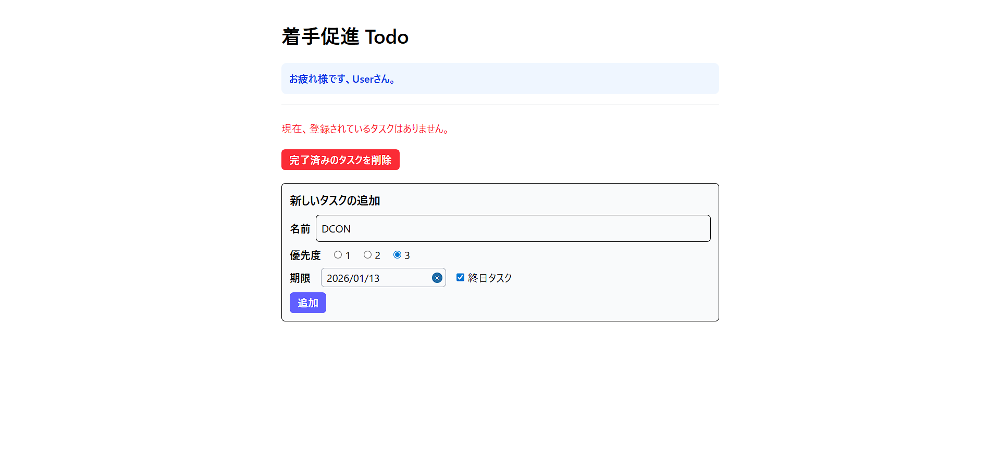
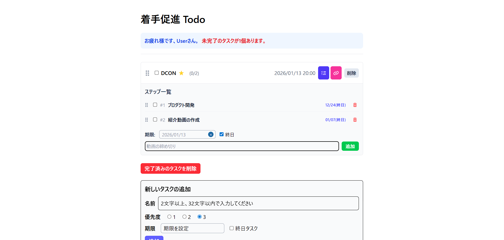

# TodoApp

Todoアプリ: https://kuri227.github.io/react-todo-app/

React + TypeScript + Tailwind CSS を使い、ブラウザの LocalStorage にデータを永続化するシンプルな Todo アプリです。
私の経験として、タスクに着手し始めることが遅くなってしまい、最終的に期日のギリギリにタスクを終了させることがたくさんありました。それらの経験を活かして、このTodoAppでは「大きな作業を小さなステップに分解して設定することで着手しやすくする」ことと、「資料等のリンクをタスクと紐づけて保管しておくことで作業を始めやすくする」ことを主の目的として開発しました。

## コンセプト
- 大きなタスクを親タスク → サブタスク（ステップ）に分解して、まず「一歩」を踏み出しやすくする
- 各タスクに参考リンク（URL + 説明）を紐づけ、必要な資料へワンクリックでアクセスできるようにする
- ドラッグ＆ドロップでタスクとサブタスクの並び替えが可能で、直感的に優先度・工程を管理できる

## 主な機能
- 親タスクの作成・削除・完了管理
- サブタスク（ステップ）の追加・削除・完了・並び替え（ドラッグ＆ドロップ）
- 各タスクに複数の参考リンク（説明 + URL）を追加・削除
- 期日の設定（終日または時刻指定）と期限切れの視覚的警告表示
- ローカルストレージによる永続化（初回は initTodos を読み込み）
- 簡易バリデーション（タスク名長さ制限、必須チェック等）

## オリジナリティ・工夫（挑戦した点）
- ステップ指向 UX:
  - 親タスクを「目標」、サブタスクを「最小ステップ」として扱うことで、着手ハードルを下げる設計を採用
- タスク直結の参考リンク:
  - 作業に必要な資料をタスク内に保存でき、作業開始時の情報検索コストを削減
- 期限の優先可視化とソート:
  - 期限切れの強調表示、期限順ソートなどを実装し、重要度の高いサブタスクを上位に表示する工夫を実装
- D&D の導入:
  - @hello-pangea/dnd を用いて親タスク・サブタスク双方のドラッグ＆ドロップ並べ替えを実現。状態の整合性を保つロジック作成に注力
- UX 向上の細部調整:
  - Enter での確定や入力長制限、アクセシビリティを意識したキーボード操作対応などの改善を行った点

## 技術スタック（主要ライブラリ）
- 言語 / フレームワーク: React, TypeScript
- ビルド / 開発: Vite
- スタイリング: Tailwind CSS
- D&D: @hello-pangea/dnd
- 日付処理: dayjs, react-datepicker
- アイコン: @fortawesome/react-fontawesome
- UUID: uuid
- パッケージ管理: npm
- 主要ファイル:
  - src/App.tsx, src/TodoList.tsx, src/TodoItem.tsx, src/types.ts, src/initTodos.ts

## 実際の動作

| Todoの外観 |
|---|
|  |

| タスク一覧画面 - 親タスクとサブタスクの表示 |
|---|
|  |

| 参考リンク追加機能 - URL と説明を入力 |
|---|
|  |

## 主な参照ファイル
- src/App.tsx
- src/TodoList.tsx
- src/TodoItem.tsx
- src/types.ts
- src/initTodos.ts
- vite.config.ts
- package.json

## 開発履歴
- 2025年10月23日：プロジェクト開始
- 2025年11月18日：主要機能の実装・デプロイ完了（想定）

## 開発期間・取り組み時間
- 期間: 2025-10-23 〜 2025-11-18
- 取り組み時間: 約 20 時間（設計・実装・検証・デプロイ含む）

## ライセンス
MIT License

Copyright (c) 2025 KR

Permission is hereby granted, free of charge, to any person obtaining a copy
of this software and associated documentation files (the "Software"), to deal
in the Software without restriction, including without limitation the rights
to use, copy, modify, merge, publish, distribute, sublicense, and/or sell
copies of the Software, and to permit persons to whom the Software is
furnished to do so, subject to the following conditions:

The above copyright notice and this permission notice shall be included in all
copies or substantial portions of the Software.

THE SOFTWARE IS PROVIDED "AS IS", WITHOUT WARRANTY OF ANY KIND, EXPRESS OR
IMPLIED, INCLUDING BUT NOT LIMITED TO THE WARRANTIES OF MERCHANTABILITY,
FITNESS FOR A PARTICULAR PURPOSE AND NONINFRINGEMENT. IN NO EVENT SHALL THE
AUTHORS OR COPYRIGHT HOLDERS BE LIABLE FOR ANY CLAIM, DAMAGES OR OTHER
LIABILITY, WHETHER IN AN ACTION OF CONTRACT, TORT OR OTHERWISE, ARISING FROM,
OUT OF OR IN CONNECTION WITH THE SOFTWARE OR THE USE OR OTHER DEALINGS IN THE
SOFTWARE.